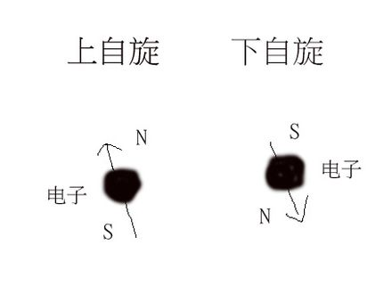

Of course not! 但是人和电子确有很多相似之处。

**人**和电子都具有左手和右手。人具有左手和右手，人的左手能做出的动作右手也能做出，右手能做出的动作左手也能做出。我们称为左手和右手是**对称**。但是左手和右手也仅仅是对称而已，左手和右手绝不相同。无论你怎么摆弄姿势，你的左手和右手绝不会重合。只有左手+右手才能完整的描述你的双手。

**电子**也是类似的。原来，虽然电子是一种点粒子，但是却具有两种状态，一种是我们称为左手的，另外一种我们称为右手的。左手的电子和右手的具有**对称**的物理规律，但是确实是两种可以区分的电子状态。

一个**运动的电子** 和一个跑步的人是差不多的。跑步的人需要双手脚，那么运动的电子也需要双脚手。不过运动的电子不是双腿交替走路的，而是旋转走路的。电子的旋转具有顺时针旋转和逆时针旋转两种旋转。

如果我们可以假定自然界中的**粒子**左和右都是对称的，那么具有左手的粒子必须具有右手，具有右手的粒子必须具有左手，并且左手和右手具有完全对称的性质。当然前提是我们在讨论的粒子有俩肩膀，自然界确实存在只有一个肩膀，长了一个手的粒子。但是这种只长了一个肩膀的粒子是显然左右对称的，在此我们不再讨论。

我们曾经以为自然界必须是左右对称的。在这个思想的束缚下，理论物理学家对实验物理学家得到的实验结果感到混乱和不自恰。

直到有一天我们，我们开始尝试左和右不对称的可能性。我们惊奇的发现：存在一种叫做中微子的粒子，左和右不仅是不对称的。进一步研究发现，中微子的不对性达到了最大，中微子只具有左手状态，而不存在右手状态。不是右手发育不良，而是根本不存在右手。中微子是靠一只手走路的。
