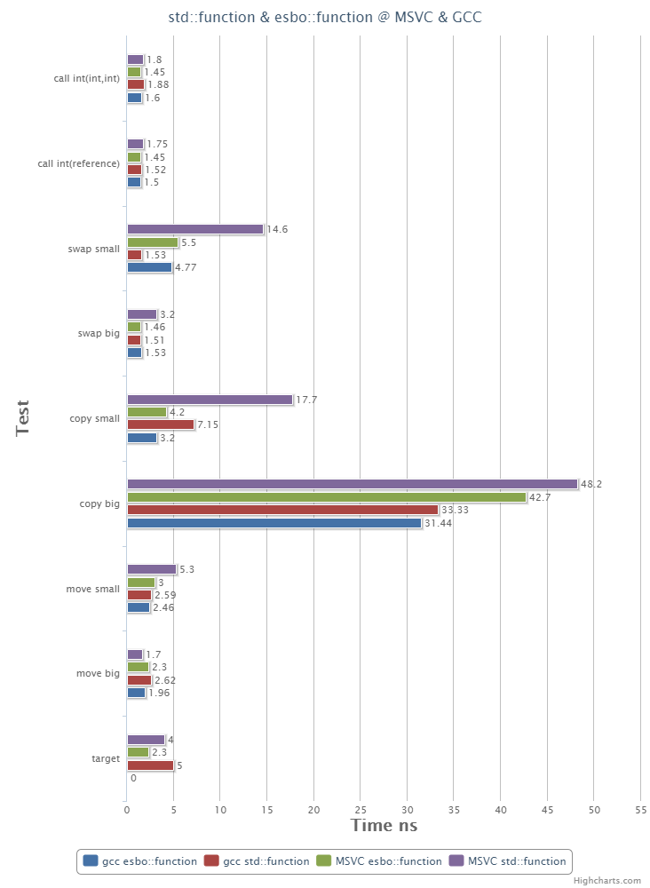

---
title: `std::function` with Effective Small Buffer Optimization (SBO)
tags: [c++, Small Buffer Optimization]
categories: [Programming]
---

对比GCC和MSVC的实现，一时手痒，自己实现了一个`std::function`的另外一种设计`esbo::function`。
代码详见 https://gist.github.com/lhprojects/70c8414f9579a6a2d577a0bbf79934a4 。我自己称为std::function with Effective Small Buffer Optimization，有效主要体现在对空间的优化上。GCC和MSVC一般需要两个指针来管理函数对象。

- 对于GCC：一个函数指针来管理函数对象的复制，移动和销毁。另外一个函数指针专门负责函数调用。

- 对于MSVC，一个指针是指向底层实现，另外一个指针是底层实现的虚函数表指针(vptr)。

`esbo::function`和GCC以及MSVC的主要区别是：

- `esbo::function`对象**除了一个指针，其余部分全部用作buffer**。

`esbo::function`

另外一个优化是，对于整数，浮点或者指针类型，通过传值来传递参数更加有效。我们针对此做了优化。详细见代码`smart_forward`。
在我们的测试中，我们发现此项优化，对于传递两个整数的情况，确实有大概10%的性能改进。
在MSVC和GCC的实现中也很容易完成这个优化。但是GCC和MSVC都没有做，可能是因为收益不大。

`esbo::function`目前还是原型阶段，大部分成员函数已经实现了。未完成的工作主要是需要写测试保证没有bug。不太有时间写原理，补上一个性能对比图吧。

# 性能测试

