# 1 详细记录一次Faceswap换脸

要说深度学习换脸，那么大家首先想到的应该是Deepfakes。可惜原版的Deepfakes已经挂了。现在比较流行了两个换脸框架是faceswap和DeepFaceLab，因为前者github上的点赞更多一点，所以我是使用了faceswap。我对DeepFaceLab只有肤浅的理解。

两者有一些区别：

* faceswap提供了各种有用的功能，并且对各种功能都提供了不错gui支持。你可以选择使用或者不用这些工具，或者根据自己的需求反复重复其中某些步骤。DeepFaceLab则提供了一系列的脚本，固定好了每一步做什么，所以对新手反而可能很友好。
* faceswap并没有采用GAN技术，而DeepFaceLab采用了GAN技术。据说使用了GAN技术图形细节更加逼真，而不使用GAN技术图形可能比较模糊。毕竟GAN使用神经网络来判定生成的脸部是否够逼真，对于神经网络来说判定模糊还是精细更容易，所以GAN网络会首先迫使生成网络生成的图像更精细。

# 2  原理

## 2.1 从A的脸生成A的脸

我们先研究一个比较简单的问题：从A的脸生成A的脸。一个典型的模型如下

```
A的脸  --[编码器]-->   潜码  --[解码器]-->   生成的A的脸 
```

A的脸经过编码会生成潜码，然后经过解码器生成图像。

编码过程为

```
--[编码器]--> : 图像 --[卷积]--> 局部表情 --[全链接/压缩]-> 表情 --[全链接/膨胀]-> 局部表情(潜码)
```

图像经过卷积后，会生成一个表示局部表情的层。例如这一层表示是否张嘴，是否合眼等局部信息。比较重要的是，局部表情这一层不包含A的脸细节纹理特征。然后经过一个全连接，将局部表情压缩为全局的状态，例如是否吃惊，是否喜悦这些脸部全局信息的整合。然后表情信息经过一个全连接，将全局的状态膨胀为局部表情，这一层我们称为潜码，这一层并不包含脸部的细节纹理信息。

解码器由向上采样曾构成。潜码经过向上采样后，将会赋予局部表情纹理信息，生成最后的图像。

```
--[解码器]--> : 局部表情(潜码) --[向上采样]--> 图像
```

经过训练，编码器和解码器中（百万或千万）的参数被调节到良好的数值，我们就可以从A的脸生成A的脸。

重要的一点是：编码器的中间的表情层是必须的。因为中间的表情层，居于整个神经网络的中心，状态数比较小，能够携带的信息只能比较紧凑和抽象。脸部丰富的二维纹理信息，并不能有效的通过这个一维向量。也就是说**生成的A的脸的纹理信息不是从输入A的脸哪里偷来的，那么纹理信息只能是存储于解码器中**。

## 2.2 从A的脸生成B的脸

回想一下，我们将A的脸换成B的脸的目标是什么？我们想要的效果是保留A的脸的所有表情，但是将纹理细节替换成B的。而纹理信息储存在解码器中，因而换脸只需要更换解码器。

所以我们采用如下步骤完成换脸

1.训练A的脸到A的脸，B的脸到B的脸的模型

```
A的脸 --[公用编码器]-->   潜码   --[解码器A]-->  生成A的脸
B的脸 --[公用编码器]-->   潜码   --[解码器B]-->  生成B的脸
```

公用编码器有相同的结构和参数。但是解码器A和解码器B有相同的结构，但是并不共享参数。完成训练后，解码器A便具有A的脸的纹理信息。解码器B便具有B的的脸的纹理信息。潜码只具有表情信息，不具有纹理信息。

对于A的脸和B的脸，必须采用相同的编码器，只有这样解码器A和B对于潜码的诠释才是一致的。

2.既然解码器A和解码器的潜码是通用的，我们就可以通过交换解码器，来交换脸的纹理信息。

例如使用B的脸替换A的脸，如下所示

```
A的脸 --[公用编码器]--> 潜码     --[解码器B]-->  A的表情B的脸
```

# 3 硬件配置

感觉至少拥有一台安装了NVIDIA显卡的台式计算机才能起步，不然你可能要十天一个月才能有一个勉强的作品。GPU越强越好，显存越大越好，最好大于8GB。如果没有GPU，那么CPU约强越好，但是CPU肯定跟GPU还差的很远。内存8GB应该就足够了。

我个人使用的联想的拯救者P7000台式机，CPU是AMD 3700X，8个物理核；16GB 内存，显卡是NVDIA RTX 3060TI，8GB VRAM（显存）。这个配置内存富裕，显存吃紧。对于熟练使用faceswap的人，使用这个配置，完成整个换脸过程需要大概24小时。

# 4 安装faceswap

到github官方下载安装包，然后直接安装就好了。作为一名win10用户果断下载exe安装包。安装时选择NVDIA平台。安装程序会帮助你安装tensorflow，cuda和cudnn。但是NVDIA驱动程序驱动需要你自行更新到最新。最后运行 `faceswap_win_launcher.bat`可以打开图形界面。

## 4.1 RTX 30XX

faceswap自带的tensorflow版本是2.3，使用的是cuda10.1。然而cuda10.1并不支持RTX 3060Ti。如果你也使用的是RTX 30XX系列显卡，你可以参考我的环境

* 卸载mini-conda自带的cuda，安装cuda11.0.3 (cuda 11.0.1 并不能用)
* 卸载mini-conda自带的cudnn，安装cudnn 8.0.2
* 卸载mini-conda自带的tensorflow，安装tensorflow-gpu 2.4
* NVIDIA更新驱动程序到461.09版本

# 5 训练样本

训练大概需要每张脸在不同视角至少几百张图片。显然为了为了保持结果准确，同一张脸应该风格相似。要得到如此大量风格相似，不同视角的图片，最好的方法自然是从视频中提取。最好选取那些采访或者演讲视频。演讲视频可能更好一点，因为演讲视频视角更加丰富。

开始从iqiyi找到了一段刘女神的高清的采访视频，但是iqiyi下载下来是爱奇艺私有格式qsv文件，身为iqiyi尊（乞）贵（丐）会员，下载下来的文件竟然是这么个玩意儿。网上查到某软件声称可以转码，但是看评论说并不行。所以果断放弃了iqiyi。然后网上说腾讯视频下载的视频也是使用一种私有格式，啊，果然都很狡猾，那就不让你们赚我会员钱了。幸好在B站找到了一样的视频，然后在[国外某网站](https://github.com/Henryhaohao/Bilibili_video_download)找到了下载器。需要注意的是，如果想要使用这个下载器下载，需要指定av号，链接的形式必须是`https:/****.com/video/av*******/`这种形式。这种形式的链接，直接百度比较方便得到。如然是站内搜索，可能链接的格式不对。由于采访视频中，很多片段都是过场动画，没有想要的人脸。为了节约后续处理的时间，先对视频进行了编辑。我使用的剪辑软件是免费的shotcut，操作还是蛮简单的，大概10分钟摸索出怎么分割连接视频。

最终得到刘女神的超清(1280x720, 720P)视频，长度约为4:52秒，帧速率为25帧每秒。

<p style="text-align: center;">
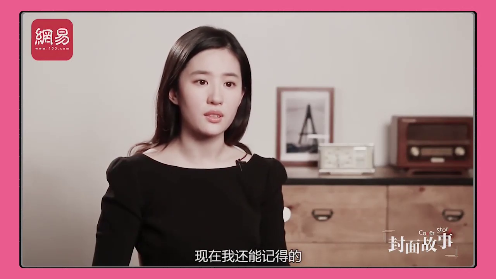
</p>


如法炮制，在B站找到了杨女神采访的采访视频。可是从B站下载的视频清晰度不高。而视频清晰度对最终结果有很大的影响。所以又从油管网找到了一样的一段视频。然后使用某个付费的油管下载器（这个下载器同时支持P站和B站，咳咳，所以值得拥有）把视频下载下来。

最终得到杨女神的超清(1280x720, 720P)视频，经过剪辑后长度约为3:02秒，帧速率为25帧每秒。

<p style="text-align: center;">
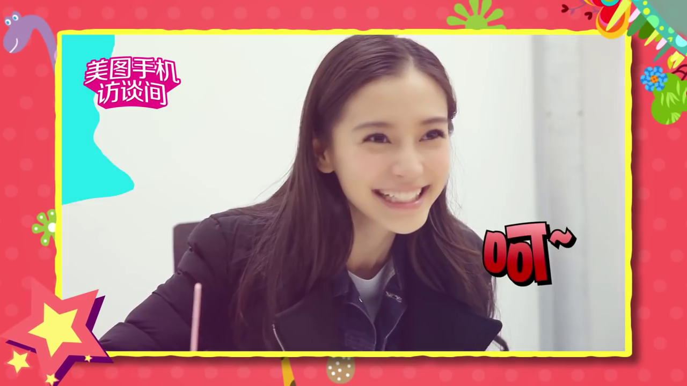
</p>
# 6 提取

下面要做的就是从视频文件中提取脸的图片了。提取过程分为三步骤：探测，对齐和制作掩码。

* 探测，即探测人的脸个数和位置。

* 对齐，即确定人的脸的特征点和朝向。特征点（landmark）包括例如眼角，嘴角，下巴的位置等等。

* 掩码，即生成一个掩码可以覆盖人脸。我们只关心人脸部的替换，并不替换脸部以外的背景。掩码有两重作用

  * 训练的时候，需要掩码来屏蔽背景，脸部以外的部分不进行训练。
  * 转换的时候，掩码以外不进行替换，我们只替换掩码内的人脸。

  在这一步会根据特征点自动产生有两个掩码，即extended和components。components掩码的上部的边界紧贴着眉毛，而extended多包含了眉毛和额头之间的一部分。

## 6.1 提取

提取过程将提取出人脸图片，并且将特征点和掩码信息保存在对齐文件中。对齐文件可以包含多个掩码，但是训练和转换时，只使用其中一个掩码。提取杨宝宝脸部图片的操作界面如下：

<p style="text-align: center;">
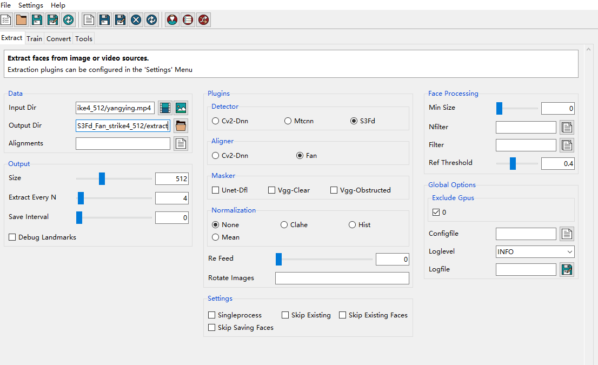
</p>

**选项配置**

* Data.Input Dir = yangying.mp4，即源视频文件，脸的图片就是从这个文件提取。
* Data.Output Dir = extract，即提取的脸的图片要保存的目录。
* Data.Aligments = None，即生成的对齐文件的保存目录，如果留白，则默认保存在`yuangying.mp4`所在的文件夹，命名为`yangying_alignments.fsa`。

* Output.size = 512，这是输出图片的总像素，包括了脸和和脸外部的一些背景，脸本身没有这么多像素。
* Output.Extract Every N = 4，即每隔四帧获得保存一张图片。对于帧率25帧每秒的视频，相当于每隔4/25秒保存一张图片。这个设定间隔提取照片，差不多每张输出图片略有差异。这样既减少了提取的时间，更减少了后期训练的时间。相同iteration次数，训练的效果应该更好了。对于相同的训练时间，结果应当变好了。
* Output.SaveInterval = 0，即最终将所有图片一次性保存到内存中，如果您有足够大VRAM或者RAM可以这样设置。
* Plugins.Detector = S3Fd，探测脸的算法，这个算法是三个选项中最好的。
* Plugins.Aligner = Fan， 对其脸的算法，这个算法是两个选项中最好的。
* Plugins.Masker =  None，尽管设置为None，但是依然会生成两种掩码(extended, components)。
* Global Options.Exlude Gpus.0 = 勾选，即排除GPU:0，主要是原因是使用GPU后，VRAM爆掉了。但是在VRAM爆掉前目测，GPU速度是CPU的十倍。

我们使用最好的探测和对齐算法，尽管更好的算法可能比较慢。但是这一步不需要反复尝试优化，而且总时间能够忍受，所以值得使用最好的算法。对杨女神完成操作后，对刘女神也做相应的操作。经过大约40分钟的处理，便可以得到大老婆和小老婆的图片和相应的对齐文件。文件目录结构为

```
yangying/extract_configration_1/yangying.mp4            # 源文件
yangying/extract_configration_1/yangying_alignments.fsa # 对齐文件
yangying/extract_configration_1/extract/yangying_*.png  # 提取出来的图片

liuyifei/extract_configration_1/liuyifei.mp4
liuyifei/extract_configration_1/liuyifei_alignments.fsa
liuyifei/extract_configration_1/extract/liuyifei_*.png
```

女神们提取出来的第一张图片分别如下：

<p style="text-align: center;">
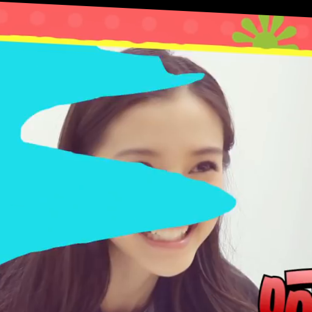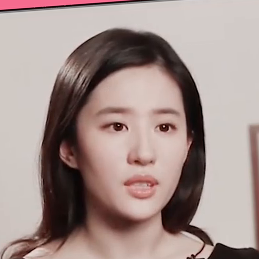
</p>

## 6.2 对齐信息

使用如下图形界面查看和调整对齐信息：

<p style="text-align: center;">
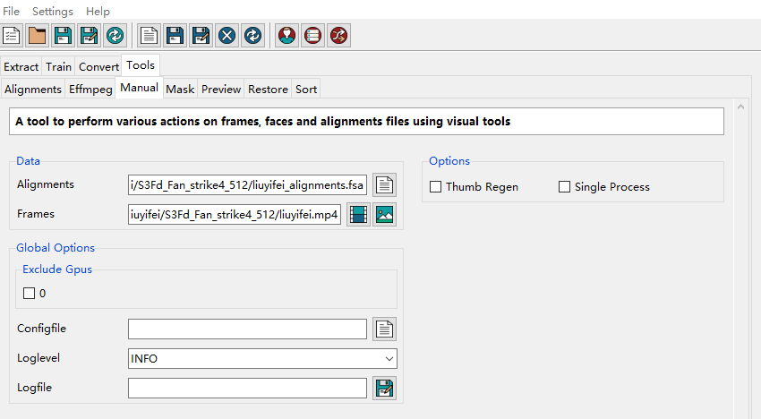
</p>

**选项配置**

* Data.Alignments = liuyifei_alignments.fsa，即对齐文件，这次我们要刘女神出马。
* Data.Frames = liuyifei.mp4，即刘女神原始源视频，不能使用extract出来人脸图片。

效果如下图。这里读取了对齐文件中的信息，并且标记在人脸的图片上。我们可以看到粉红色的的特征点。

<p style="text-align: center;">
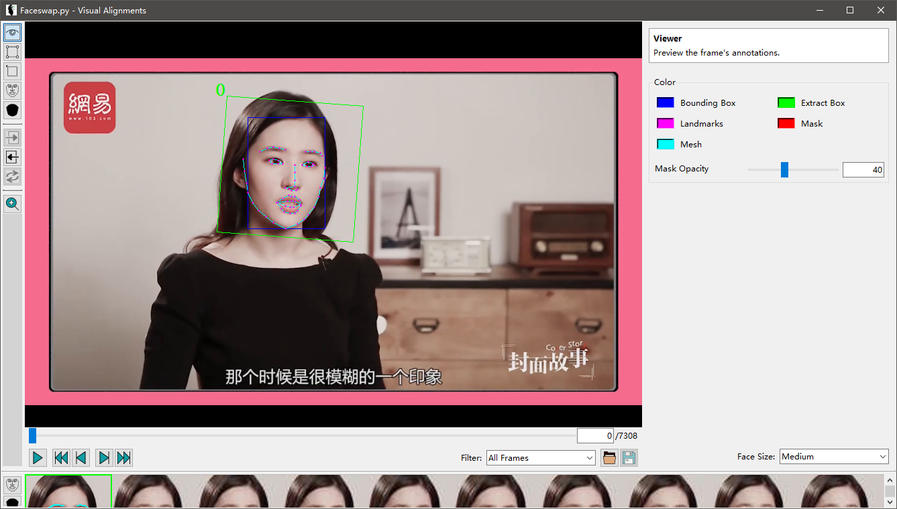
</p>

脸部放大（附加一定旋转）后，便可以得到在extract步骤我们得到脸部图片。

<p style="text-align: center;">
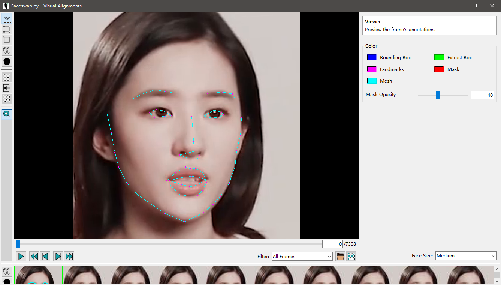
</p>

打开显示Mask，此时显示的是components掩码，可以看到components掩码可能不会包含全部眉毛，因而extended掩码会更安全一些。

<p style="text-align: center;">
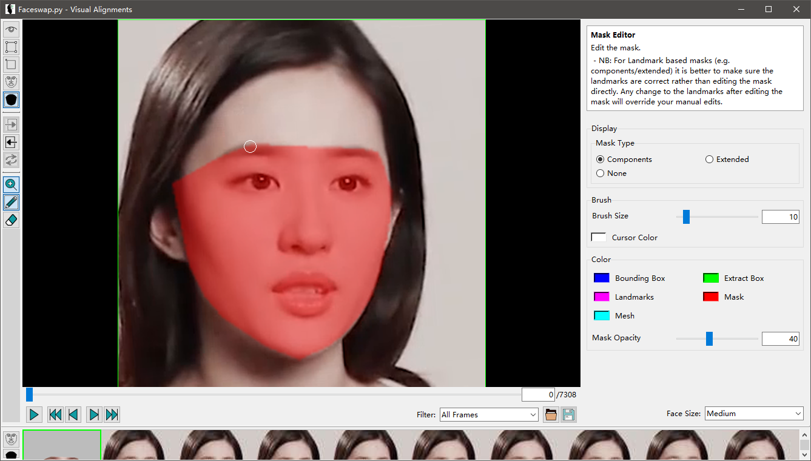
</p>

## 6.3 数据清理

### 6.3.1 人脸图片排序

由于杨女神提取出来的图片中，很多其实没有人脸或者人脸上有遮挡。这些没有用的图片需要人工删除。为了提高人工处理的效率，我们可以对图片进行排序。排序有两重作用，第一重作用是，与人脸差别很大的图片会排到前边；第二重作用是，相似的图片会倾向于挨着，因而方便删除。

<p style="text-align: center;">
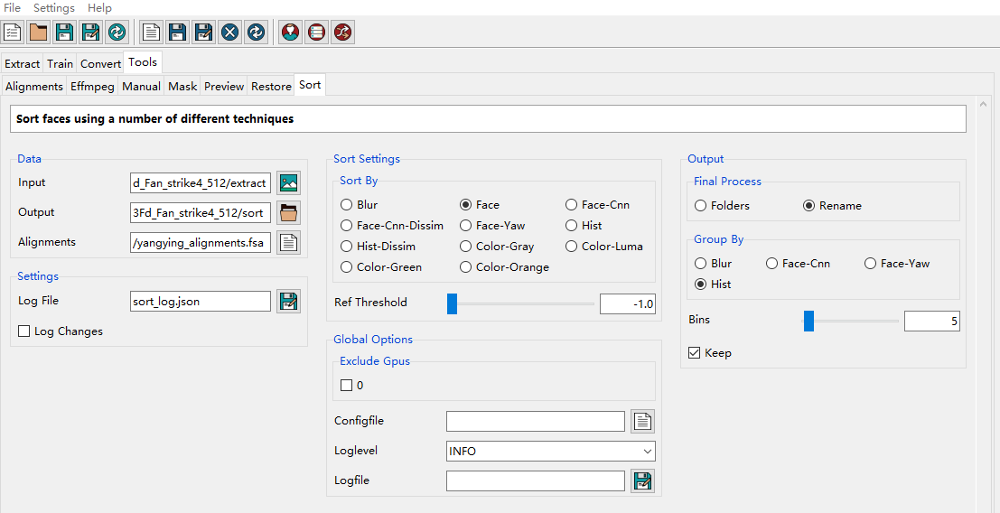
</p>

**选项配置**

* Data.Input = extract，即上一步提取的人脸图片的目录
* Data.Output = sort，即排序后图片保存的目录
* Data.Alignments = yangying_alignments.fsa，即上一步提取人脸图片的对齐文件。注意，faceswap是根据图片的哈希值来匹配人脸图片和对齐文件中项的，所以更改人脸图片的命名不会有什么影响，但是不要更改人脸图片的任意一个像素！

* Sort Settings. Sort By = Face，即按照脸来排序，这里感觉并不要深入理解
* Global Options. Exclude Gpus.0 = False，即使用GPU:0来加速。
* Output.Final Process = Rename，即重新命名文件。文件重命名后，按照文件名排序，那么靠前的图片一般就是垃圾图片。
* Output.Group By = Hist，对于我们的情况可能没作用（？）
* Output.Keep = True，保留原来的图片。

### 6.3.2 删除无用的人脸图片

对人脸图片进行排序后，我们可以复制`sort`目录到`clean`目录，然后把`clean`目录中将不需要的图片全部删除。不需要的图片包括，没有人脸的图片，有遮挡的图片，过暗的图片，模糊的图片。

### 6.3.3 清理对齐文件

我们删除了人脸图片，不再需要图片本身了，但是这些图片相应的对齐信息还在对齐文件中`yangying_alignments.fsa`，现在我们需要将这些不需要的对齐信息删除掉。这一步还有一个额外的副作用，那就是sort后，原来的人脸图片文件名遭到了修改了，这一步除了调整对齐文件，还会将图片文件名恢复为原来的文件名，也就是`extrac`那一步产生的人脸图片的文件名。

<p style="text-align: center;">
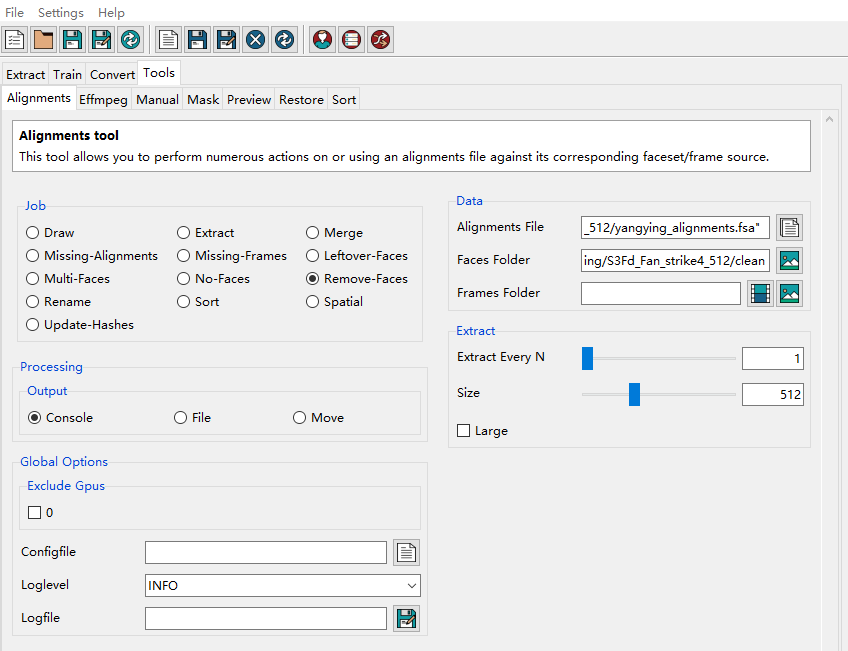
</p>
**选项配置**

* Job = Remove-Faces，即任务为移除对齐文件中的多余的信息。
* Data.Alignments = yangying_alignments.fas，即extract步骤产生的对齐文件，这个文件中的多余的信息就会被移除，同时在相同目录下产生一个备份，所以您不需要手动备份。
* Data.Output = clean，即清理无用图片后，其他所有图片所在的目录。

对杨女神的完整提取照片的过程就结束了。而刘女神的视频是我经过剪辑的，只包含了女神正脸的照片，图片质量全部都非常好，所以不需要进行排序和调整对齐文件。

# 7 训练

现在我拥有大量的女神们的头部照片，并且可以通过对齐文件中的信息将每张图片的脸部摆正，调节到合适大小，并且可以通过掩码屏蔽背景。现在就可以开始训练编码器和解码器了。我们想用杨女神的脸替换刘女神的脸。操作界面如下：

<p style="text-align: center;">
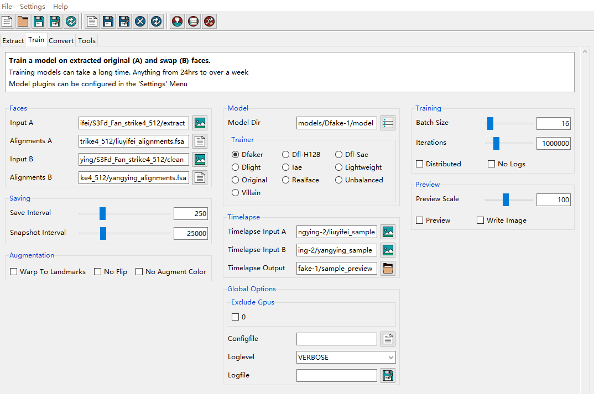
</p>


**选项配置**

* Faces.Input A = liuyifei/.../extract，即刘女神的脸部图片。
* Faces.Alignments A = liuyifei/.../liuyifei_alignments.fsa，即刘女神脸部图片的对齐信息。
* Faces.Input B = yangying/.../clean，即杨女神的脸部图片，是经过清理后的。
* Faces.Alignments B = yangying_alignments.fas，即杨女神脸部图片的对齐信息，是经过清理后的。
* Model.Model Dir = .../model，即模型要储存到的目录。
* Model.Trainer = Dfake，我们采用Dfake模型，Dfake模型的输入和输出大小128px。我们人脸图片为512px，即使中心的人脸部分像素也大约为200多像素。因而会首先缩小图片，然后再输入到模型中。
* Saving.Save Interval = 250，即每250次迭代保存一次模型（覆盖原来模型）。
* Saving.Snapshot Interval = 25000，即每25000次迭代拷贝备份一次模型。
* Timelapse.Timelapse Input A =  liuyifei_sample，我建立的这个目录，里面有14张刘女神的照片。
* Timelapse.Timelapse Input B =  yangying_sample，我建立的这个目录，里面有14张杨女神的照片。
* Timelpace.Timelapse Output = sample_prview，我建立的这个目录，空白目录。每次保存模型时候，程序会将Timelapse A/B中14张图片换脸的结果保存在Timelapse Output。
* Training.Batch Size = 16，随机批量梯度下降算法中的批的大小。
* Training.Iterations = 1000000，训练的总迭代次数，实际上我们总是把这个数字设置的足够大，感觉训练效果比较好的时候就可以提前结束训练了。

除此之外，还有一些设置，在菜单里

<p style="text-align: center;">
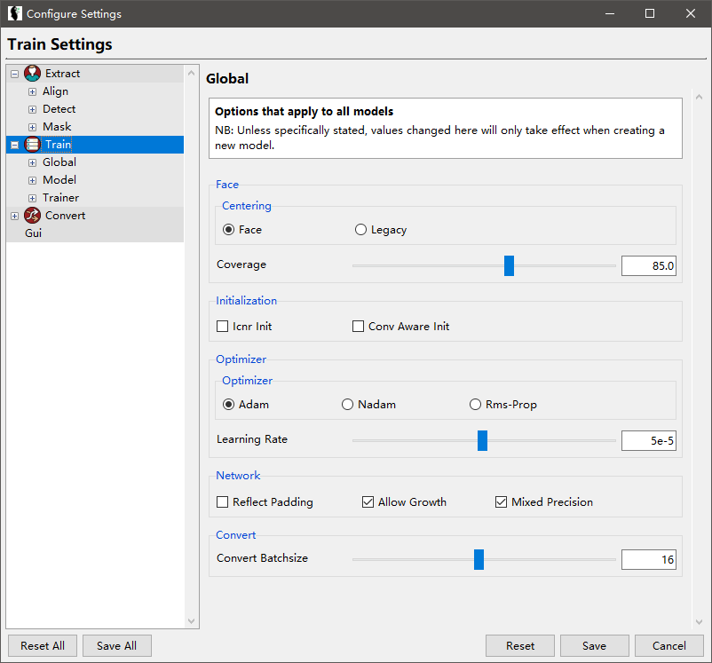
</p>

**选项配置**

* Faces.Converge = 85%，训练中输入图像占整个脸的比例（脸的大小小于提取出来的图片的大小），由于女神们的下巴比较长，Converge 比例小了容易漏掉下巴。
* Optimizer.Optimizer = Adam，懂得都懂，经典。
* Network.AllowGrowth = True，不设置这个容易出现VRAM不足的的问题。
* Network.Mixed Precision =True，混合精度可以有效加快训练速度。

<p style="text-align: center;">
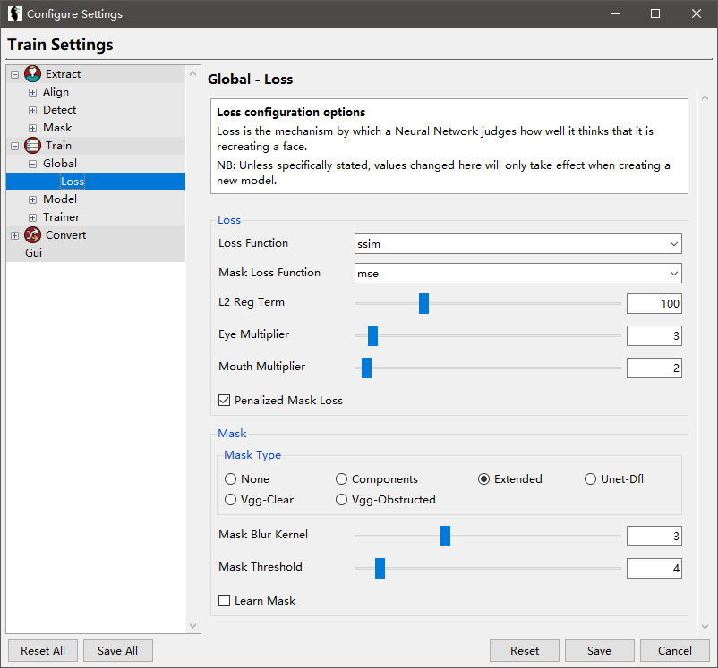
</p>

**选项配置**

* Mask.Mask Type = Extended，在提取步骤我没有勾选任何Mask Type，所以我现在只有components和extended两种掩码可以用。不要选Components，选择Extended，不然可能漏掉眉毛。


经过15个小时的训练，共进行了160K次迭代，速度大约为每秒100个图片（注意，这里每次迭代会对两个人的脸的图片分别处理一个批次。`100=2*16*160/(15*3600)`）。

<p style="text-align: center;">
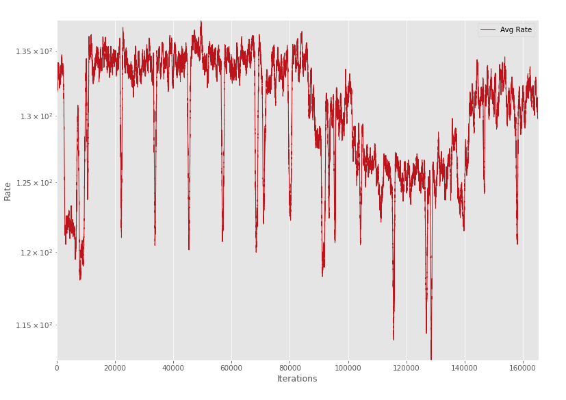
</p>

这是女神脸部训练集的的损失函数：

<p style="text-align: center;">
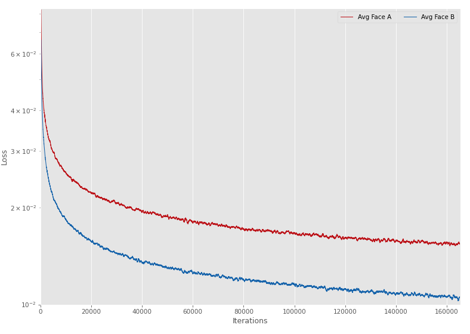
</p>

红线表明了A的脸替换为A的脸的损失程度，而蓝线表明了B的脸替换为B的脸的算是程度。然而使用损失函数并不只管。我们可以使用Timelpace.Timelapse Output中换脸的结果来直观的观察换脸效果。最后效果如下：

<p style="text-align: center;">
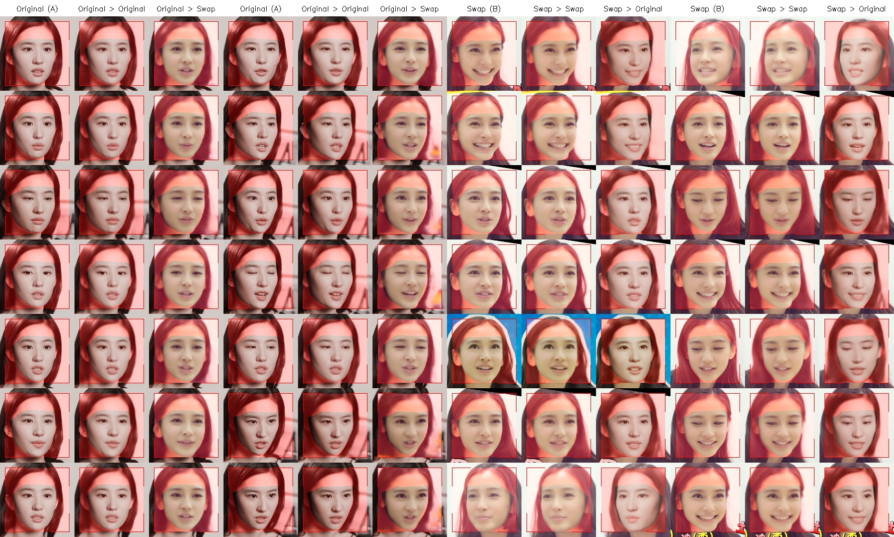
</p>

# 8 转换

现在我们可以对摆正的，大小合适的，提供掩码的情况的脸部图片进行换脸了。我们要对一个视频中的人脸进行换脸，我们需要每一帧（如果有人脸的话）人脸的对齐信息。所以我们需要重复提取步骤中的操作，但是这次将Extract every N设置为1，即每一帧我们都要提取人脸。然后和以前一样进行排序和清理工作。下面进行转换，图形界面如下：

<p style="text-align: center;">
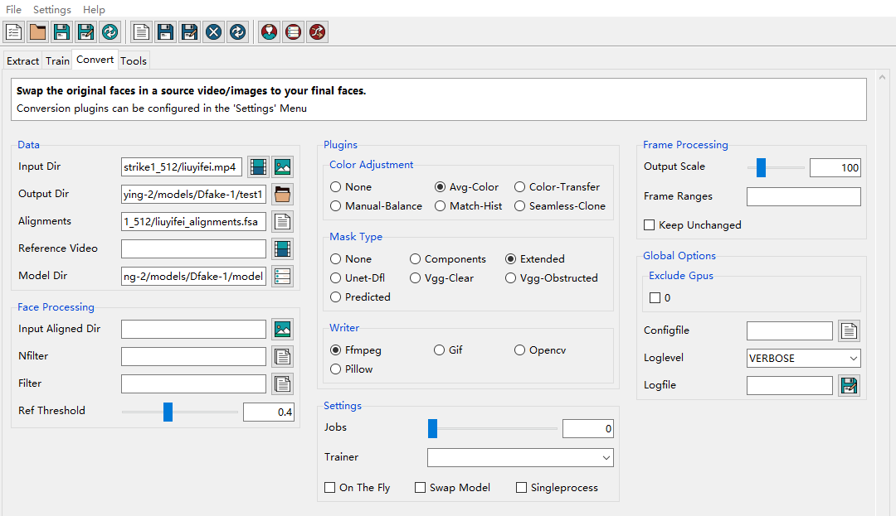
</p>

**选项配置**

Data.Input Dir = liuyifei.mp4，即需要转换的视频

Data.Output Dir = output， 即转化完成后视频保存的目录

Data.Alignments = liuyifei_alignments.fsa，即每一个具有人脸的帧的对齐信息，如果不提供对齐信息，那么就不转换这一帧，不要使用第一步提取训练集人脸图片中的对齐文件，否则只有1/4的人脸能得到转换。

Data.Model = model， 上一步训练得到的模型所在的目录。

Plugins.Color Adjustment = Avg-Color，我们使用默认的Avg-Color。主要是因为杨女神的光源是全方位角的，脸上没有阴影，而且杨女神的脸比刘女神的脸大一点，所以杨女神的脸完美覆盖了刘女神的脸，所以默认的颜色调整就足够好了。

Plugins.Mask Type = Extended，Extended相比Components包含了更多了额头的信息，这样保证眉毛不会跑到掩码外边去。

Plugins.Writer = Ffmpeg，即存储为mp4格式的视频。

除了这里选项，菜单中选项也很重要：

<p style="text-align: center;">
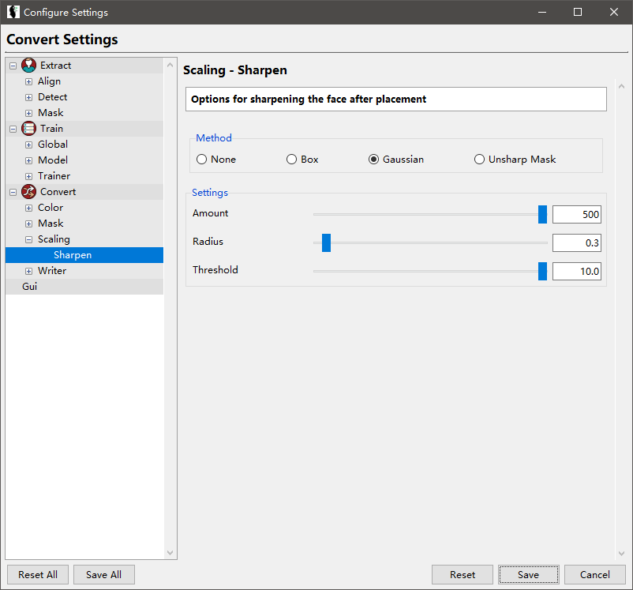
</p>

由于原视频中杨女神的脸太糊了，所以最终生成的杨女神脸部也很糊（相比之下，刘女神的脸就精细很多）。我们必须打开锐化选项，对转化后的脸部进行锐化。

最后终于可以进行换脸转化了，经过几分钟的等待，就可以生成[mp4视频](https://www.bilibili.com/video/BV1Ph41127XM/) 。

<p style="text-align: center;">
<iframe src="//player.bilibili.com/player.html?aid=203544277&bvid=BV1Ph41127XM&cid=280519649&page=1" scrolling="no" border="0" frameborder="no" framespacing="0" allowfullscreen="true"> </iframe>
</p>

我压缩的gif如下：

<p style="text-align: center;">
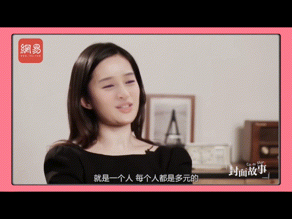
</p>
# 10 讨论

## 10.1 B脸的多样性

假设我们想要将A的脸替换为B的脸，那么生成的脸逼真的充分条件是

* **解码器B**能够很好的解码 **A的脸产生的潜码**。

而能够达到上面的充分条件的充分条件是下面两个条件：

* 训练集的损失函数足够小，或者说B的脸替换为B的脸足够逼真，或者说**解码器B**能够很好的解码**B的脸产生的潜码**。
* **转化**过程中A的脸产生的潜码，B的脸在训练的时候能够覆盖到。

实现后者要求我们要有丰富多样的B的脸的样本。

## 10.2 掩码的精确性

显然掩码的精确性是很重要的。明星脸的问题是，明星脸都太长太尖了，老外的模型经常不能很好的处理下巴。解决方法：手动调节对齐文件中的特征点位置。

## 10.3 B脸与A背景的一致性

但是最终结果好坏，除了精确的生成B的脸外，还要考虑B的脸和A的背景的一致性。

* 肤色，尽管我们精确的生成了B的脸，但是由于B的脸的肤色与A的脸不一致，尤其是额头部分色差会很明显，那么最终效果会比较差。解决方法：需要采用颜色修正来改正。
* 阴影，如果照射B的脸的光源和照射A的脸的光源方向不一致，那么最终效果也会比较差。解决方法：丰富B的脸的训练样本，增加多种光源下B的脸的样本。

## 10.4 训练迭代次数

一般在深度学习训练中，并不是迭代的次数越多越好。因为存在过拟合现象，提前终止训练反而可以得到比较好的效果。但是在faceswap中（可能是由于比较小的学习率），迭代的次数越多越好。实际上如果你觉得继续投入的大量的时间和电费，但带来的效果的提升很微小，就可以结束训练了。

