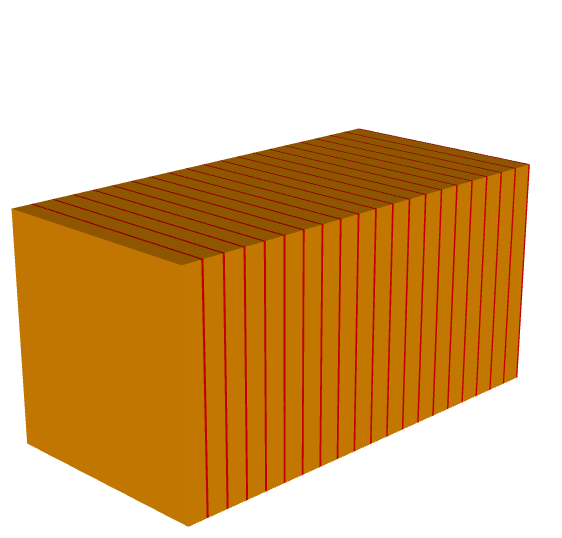
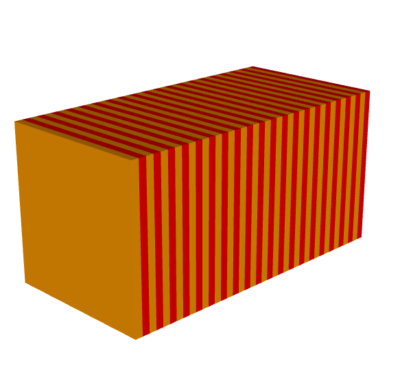
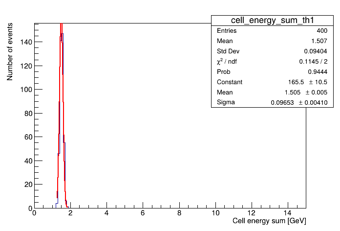
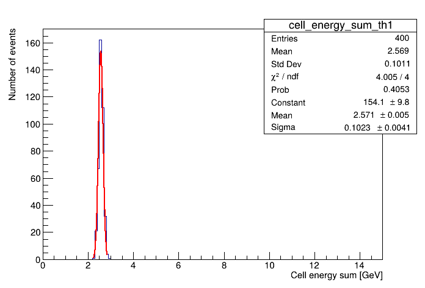
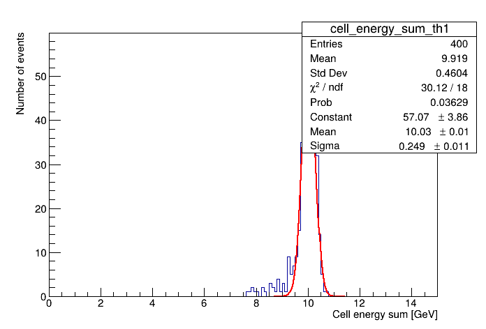
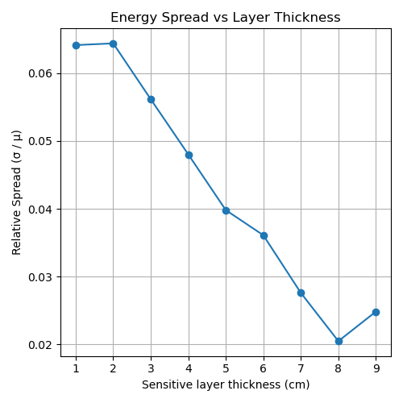

*(Based on Slide 20 of [DRD6 DD4hep Tutorial, April 2025](https://indico.ijclab.in2p3.fr/event/11400/sessions/5873/attachments/25413/37372/DRD6DD4hepTutorial_April2025.pdf))*

## 1. Objective

This report summarizes the work completed for **Hands-on 3** of the [DRD6 DD4hep Tutorial](https://indico.ijclab.in2p3.fr/event/11400/sessions/5873/attachments/25413/37372/DRD6DD4hepTutorial_April2025.pdf). The goal is to study how the **energy resolution** of a sampling calorimeter varies with changes in the **sampling structure**, specifically the thickness of the sensitive material layer within each sampling unit.

The code used for this analysis is available at:  
👉 [https://github.com/lhprojects/DD4hepTutorials](https://github.com/lhprojects/DD4hepTutorials)

## 2. Experimental Setup

- The calorimeter is composed of repeating layers, each consisting of:
  - A **Silicon** sensitive layer (active material)
  - A **Brass** absorber layer (passive material)
- The **total thickness of each sampling unit** (1 absorber + 1 sensitive layer) is fixed at **10 cm**.
- The **sensitive layer thickness** is varied from **1 cm to 9 cm**, while the absorber thickness is reduced accordingly to maintain the 10 cm total per unit.
- These material configurations (especially thick Silicon) are **not realistic for actual detector construction**, but are used here for illustrative purposes in simulation.
- All setups use the same number of layers and overall detector depth.
- For each configuration, **400 events** are simulated using a **particle gun** shooting monoenergetic electrons (e⁻) directly into the calorimeter.

### Geometry Comparison

- **Figure A**: Geometry with 1 cm Silicon + 9 cm Brass → mostly absorber  
  

- **Figure B**: Geometry with 5 cm Silicon + 5 cm Brass → more sensitive material  
  

## 3. Analysis Method

- The `.root` files are processed using a Python script with `podio` and `ROOT`.
- For each event, the **total energy deposited** in the Silicon layers is summed.
- Histograms are created and fitted with a Gaussian to extract:
  - **Mean deposited energy** (`μ`)
  - **Standard deviation** (`σ`)
- The **relative energy resolution** is calculated as: `σ / μ`

- A summary plot is generated to show how resolution changes with sensitive layer thickness.

## 4. Results

### 4.1 Energy Distributions

- **Figure 1**: 1 cm Silicon  
  

- **Figure 2**: 5 cm Silicon  
  

- **Figure 3**: 9 cm Silicon → shows low-energy tail  
  

### 4.2 Resolution Trend

- **Figure 4**: Relative resolution (`σ / μ`) vs. sensitive layer thickness  
  - Resolution generally improves with increasing sensitive thickness  
  - A slight degradation is observed at 9 cm  
  

## 5. Discussion

- Increasing the sensitive layer thickness improves energy resolution due to better sampling of electromagnetic showers.
- However, with 9 cm of Silicon, the remaining 1 cm of Brass absorber is insufficient to fully contain the shower.
- This results in **energy leakage**, which appears as a **low-energy tail** in the energy distribution and increases the standard deviation (`σ`).

## 6. Conclusion

This simulation study shows that energy resolution in a sampling calorimeter improves with thicker sensitive layers—up to a point. If the absorber becomes too thin, **shower containment is compromised**, leading to degraded resolution despite increased sensitive material. These results highlight essential trade-offs in calorimeter design and optimization.

**Note:** This report was initially written by ChatGPT, revised by me, and then refined again with ChatGPT’s assistance.
