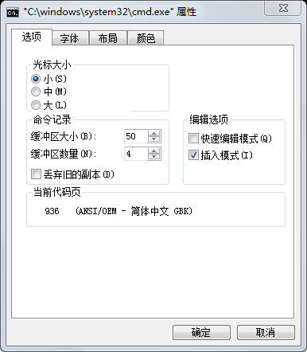

# Unicode

什么是unicode呢，请看[Wikipedia][Wiki]。


## UTF-8

现在使用UTF-8的情况越来越多了。


那么UTF-8是什么呢，UTF-8是Unicode的一种具体编码方案。用字节流来表示unicode字符流。

不同unicode字符区间，在UTF-8种编码方法有不同。

```c++
[U+0000 - U+007F]           0xxx,xxxx
[U+0080 - U+07FF]           110x,xxxx  10xx,xxxx
[U+0080 - U+07FF]           1110,xxxx  10xx,xxxx  10xx,xxxx
[U+10000 - U+10FFFF]        1111,0xxx  10xx,xxxx  10xx,xxxx  10xx,xxxx
```

从编码上看，UTF-8具有以下特点

- 兼容ASC-ii。ASCII只用到了0到127。也就是说ASCII的字节流是完全合法的UTF-8字节流，明确表示相同的内容。如果在UTF-8只用到了ASCII字符，那么相应的字节流是完全合法的ASCII字节流，并且表示完全相同的内容。

- 如果一个字节最高位是0，那么这个字节一定单独是一个Unicode字符，并且是一个ASCII字符。例如你字节流中找到了一个字节等于97，那么这个字节一定表示字符'a'，这让程序在不用完全将UTF-8字节流转换成字符流的情况，具有一定处理UTF-8编码的能力。


## UTF-16

那么UTF-16是什么呢，UTF-16是Unicode的另外一种具体编码方案。在UTF-16编码的单位是码元，一个码元是两个bytes。大多数字符使用一个码元来表示，有些情况需要两个码元来表示。

具体怎么编码呢？不同unicode字符区间，在UTF-16种编码方法有不同。

- 对于[U+0000 - U+D7FF] 和U+E000 - U+FFFF]，使用一个16位码元来表示一个unicode字符。
- 对于[U+10000 - U+10FFFF] ，使用两个16位码元来表示一个unicode字符。流程如下

1. 原范围[U+10000 - U+10FFFF]

2. 减去0x10000得到范围[U+00000 - U+FFFFF]，表示为yyyyyyyyyyxxxxxxxxxx

3. 将前10位加上0xD800，作为第一个码元。将后10位加上0xDC00，作为第一个码元。表示为
   110110yyyyyyyyyy  110111xxxxxxxxxx

   

从编码上看，UTF-8具有以下特点

- 如果一个码元最高位是0，那么这一定是一个ASCII字符。例如你在码元流中找到了一个码元等于97，那么这个码元一定表示字符'a'，这让程序在不用完全将UTF-16码元流转换成字符流的情况，具有一定处理UTF-8编码的能力。

但是需要注意的是，一个码元具有两个字节。在文件存储或者网络传输的时候，基本单位是字节，一个码元会被拆散传输。所以需要更多的关于编码的细节，才能完全确定一个unicode字符如何转换成字节流。这里有两种编码

- 大端编码，即使用 `byte1 << 8 + byte2`来表示一个码元。和，

- 小端编码，即使用 `byte1 + byte2 << 8`来表示一个码元。

  

## UTF-32

UTF-32编码使用一个32位整数来表示一个unicode字符。是一种固定长度的编码。这让unicode字符处理的逻辑变的简单。但是如果将unicode字符保存在内存中，那么需要消耗更多的内存。

UTF-32编码中，一个unicode字符也是多个字节，那么在文件存储或者网络传输的时候就需要考虑如何编码一个32位整数。我们不再详细讨论。


# c++中的Unicode


## c++03 时代

在C++03时代，具有两种字符类型`char`和`wchat_t`（再此不讨论`unsigned char`和`signed char`，全文都会忽略这两种类型）。


其中`char`实际上是一种字节类型。虽然c++规范说法很模糊，但是实践上总是可以假定`char`是一个字节（不要面向不存在的平台编程）。字符串字面值`"..."`通常叫做所谓多字节字符串字面值，在c++中是`char`类型的数组。单独一个`char`实例可能无法表示一个完整字符。其所使用的编码依赖于平台。

- 对于g++，`"..."`总是UTF-8编码。

- 在Windows上`"..."`和所使用的[源代码的编码，编译系统的编码和编译选项有关][WinCharLit]。

  

`cout`是c++标准输出流，其所使用的编码和运行时系统有关。只有当字符串编码和`count`编码一致时，才可以避免乱码。

- 对于linux操作系统，`cout`总是UTF-8编码。
- 对于Windows操作系统，这个编码可以从cmd的属性页查询。例如我的属性页是936。




## C++11时代

在C++11时代，新加入了`u8"..."`字符串字面值。使用这种新的字符串字面值，我们可以强制将运行编码制定为UTF-8。需要注意的是`u8"..."`依然是`char`类型的数组。

- 在linux和g++体系，这没有带来任何变化，原本它们的多字节字符串就是UTF-8编码的。

- 对于Windows系统，其实用途也不大。

  - 已经可以通过/execution-charset:utf-8选项将运行编码设置为UTF-8。

  - `cout`依然所使用的编码依然依赖于运行的操作系统，通常不是UTF-8。（当然操作系统的api也是如此）

    

除此之外还新加入了类型`char16_t`和`char32_t`类型，它们的宽度分别是16和32位，用作UTF16和UTF-32的码元类型。这是两种全新的的类型，并不是旧类型的一种`typedef`。相应的，还有两种新的字符串字面值`u"..."`和`U"..."`分别对应UTF-16和UTF32编码的字符串字面值。


## C++20时代

在C++20时代，新加入了`char8_t`类型。这是一种全新的类型，并不是旧类型的一种`typedef`。`u8"..."`字符串字面值更会更改为`char8_t`类型的数组。`u8"..."`不能通过cout输出。

- 在linux和g++体系，这没有带来任何变化，因为原本就不需要`"u8"..."`。而且总的来看，c++11和c++14只是添加了3种字符类型和三种字面值类型（和相应的其他部件，例如三种字符串类型`std::u<N>string`）。但是并没有与原来的字符串系统做互动。

- 对于Windows系统

  - `cout`依然不需要支持UTF-8。

  - Windows支持UTF-8源文件和UTF-8运行时编码。

    

## 跨平台

No Way!!!

## 思考

总的来看`char16_t` ，`char32_t ` 都是失败的发明。


[WinCharLit]: https://devblogs.microsoft.com/cppblog/new-options-for-managing-character-sets-in-the-microsoft-cc-compiler/
[Wiki]: https://en.wikipedia.org/wiki/Unicode
