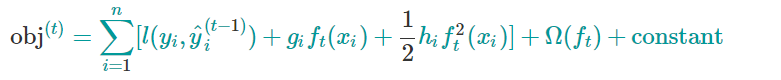
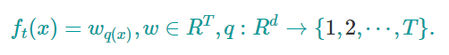
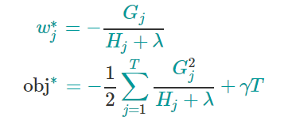

# XGBoost教程

翻译自 [Introduction to Boosted Trees](https://xgboost.readthedocs.io/en/latest/tutorials/model.html)

XGBoost表示Extreme Gradient Boosting，
这里术语Gradient Boosting起源于Friedman的论文`Greedy Function Approximation: A Gradient Boosting Machine`. 
本文是一篇关于gradient boosted tree的教程，大部分内容都是基于Tianqi Chen的幻灯片，他是XGBoost原始作者。

gradient boosted tree已经诞生一段时间了，关于这个话题，已经存在大量的材料。
在这篇教程里，我们尽量自给自足不需要额外查询资料。
我们会监督学习的基本元素以一种理想方式来讲述内容。
我们认为这样解释会更加清晰，更加正规，并且简洁阐述清XGBoost的模型。

# 监督学习的基本原理
XGBoost是用来解决监督学习问题的。在监督学习里，我们使用训练样本（有很多特征）x_i来预测我们目标变量y_i。
在我们学习介绍树是什么之前，我们来看看监督学习的基本元素。

## 模型和参数

在监督学习里，模型就是从自变量x_i预测从因变量y_i的数学结构。一个常见的模型是线性模型，在线性模型里
。预测的变量只是输入特征的线性组合。
预测的变量在不同任务（分类和回归）里有不同的解释。 举例来说， 我们可以通过logistic函数将它变换为正类的概率。我们也可以将他直接解释为某种排名。

我们需要从数据里去学习模型里的参数。
在一个线性回归问题里，未知的参数就是就是theta。
在更一般的模型里，我们将依旧用theta来表示参数。

## 目标函数：训练损失+回归

明智的选择y的定义，我们可以完成很多不同的任务，比如回归，分类或者排名。
训练一个模型就是寻找最佳参数theta，最佳的参数应该是最符合数据和标签的参数。
为了训练模型，我们需要定义我们的目标函数来衡量我们模型和数据符合的多么好。

目标函数一个重要的特征就是，他有两部分：训练损失和正则化项：

  

其中L就是训练的损失函数，而Omega就是正则化项。损失函数可以用来衡量我们的模型预言训练数据能力。
通常，L一个常用的选择是均方差（MSE），写作

  

另外一个常用的选择是logistic损失，logistic损失函数用于logistic回归：

  

人们经常忘掉加上正则化项。正则化项可以控制模型的复杂度，正则化项可以帮助我们避免过拟合。
说这么多，看起来有点抽象，所以我们考虑下面图片里的模型。
如果让你拟合一个阶梯函数。
三种的曲线中哪一个你认为是最好的？

  

正确的模型是红色模型！
请思考在视觉上这是不是一个合理的拟合？
一般性的原理是我们想要一个简单而且有预言力的模型。
在机器学习领域里，两者之间的取舍也叫做偏差-方差取舍。

## 为什么引入一般原理

# 决策树集成 （基于集成的决策树，但是这个翻译太长了没有更好的翻译了）

我们已经介绍了监督学习的基本元素。现在我们回来讨论树。
我们首先学习XGBoost使用的模型：决策树集成。
XGBoost的树集成由CART(分类或回归树)的集合组成。
举一个CART的简单例子：我们采用决策树来预测某个人是否会喜欢一款电脑游戏X。如图：

  

我们将一个家庭里的成员划分到不同的叶节点，并且给每个叶节点赋一个分数。

CART和决策树有一点不同。
在CART里，每一个叶节点会被赋予一个实数。
这样利用CART，我们能做比分类更多的事情。
在下面部分读者将会看到，这也使得我们原则上可以将分类与回归问题用统一的方式来训练。

通常，一棵树在实践中还不够强。在集成学习方法，我们是多棵树一起做预测。

  

举一个例子，我们两棵树的树继承。两棵树的分数之和为最终用来做决定的分数。我们可以发现，两棵树起到了互相补充的作用。数学上可以把我们的模型表示为

  

这里K是树的数量，f是函数（定义域是泛型空间F），F是所有可能的CART。（注：当CART与函数f一一对应，所有分叉方法和叶节点数值确定后，CART和f也就唯一确定了）我们的目标函数是

  

现在我们有一个有趣的问题：在随机森林的模型是什么？答案是：就是树集成啊。
所以随机森林和提升书其实是一种模型。区别在于我们怎么训练他们。
这就意味着，如果我们写下一段程序，可以从树集成得到预测值，那么这段程序也同样适用于随机森林。

# 树提升

现在我们已经介绍了我们模型，现在我们来学习如何训练我们的模型。答案就是（对于所有的监督学习都是）定义一个目标函数并且优化。
我们把目标函数定义下面的样子

  

## 可加性训练

我们想要问的第一个问题：树的参数是什么？我们可以发现，我们想要学习的的是函数f_i（第i课树所代表的函数），每一个函数f_i都蕴涵了树的结构和树的叶节点值。
学习树的结构远远要比传统的优化问题要难，不是简单的求出梯度那么简单。
同时学习树集成里面的所有的树是个艰难的任务。
所以，我们使用了可加性的策略。
首先固定我们已经学习过的树，然后一颗一颗添加，一颗一颗训练。
我们可以把第t步骤的模型的预测值写为

  

我们还是要问，在每一步我们想要添加什么样子的树。
很自然的我们想到，在每一步添加的树能够优化我们的目标函数：

  

假设我们正在使用均方差（MSE）作为我们的损失函数，我们目标变为

  

均方差的形式非常友好，目标函数的第一项是一个二次型！
其他我们感兴趣的损失函数，通常没有这么好的形式。
在更一般的情形，我们对损失函数机型泰勒展开，近似到第二阶：

  

这里 g_i和h_i定义为

  

移除所有常数项后，第t步，我们的目标函数就是

  

这就是第t步要添加的树的优化目标。这个优化目标一个重要的优势就是目标函数只依赖于g_i和h_i。这就是为什么XGBoost可以自定义损失函数。我们可以优化任何损失函数，包括logistic回归或者对排序，只需要输入相应的g_i和h_i就可以了。

#模型复杂度

我么已经介绍了训练步骤，但是稍等，还有一件重要的事情，就是我们的正则化项。
（早说了，我们经常忘掉他们）
我们需要定义树的复杂度Omega(f)。
为了完成这个目标，我们把f(x)定义为

  

这里，w是叶节点的数值。q是从数据点到叶节点的映射(由树的结构确定，从树的根部往下爬就找到这个数据是那个数据点了)，T是叶节点的数量。在XGBoost，我们定义模型复杂度为

  

当然，我们有其他的方式定义复杂度。但是上面的做法实践上表现不错。
很多基于树的软件包，对正则化的处理不够详细，甚至简单的忽视掉了。
这是因为传统基于树的教程仅仅强调提不纯度，而复杂度的控制只是留作读者遐想。
这里我们突出了树本身的复杂度，这样就会对整个问题有更具体的认识。

# 结构分数

下面我们到了整个推导的非常魔幻的部分。我们重新写下第t颗树的目标函数

  

这里 I_j={i|q(x_i)=j} 是第j个叶子上所有的数据点。
注意，在第二行，第一项，我们改变求和下标。因为一个叶节点上的数值都是相等的。

我们定义 G_j=sum_(i in I_j) g_i 和 H_j = sum_{i in I_j} h_i。
（注：G_j是第j个叶子上所有数据的数值对损失函数的导数之和，H_j则是二次导数之和）
我们的目标函数现在是：

  

在上面表达式中，w_j的之间是互相独立的，w_j可以首先优化掉，我们的目标函数变为

  

现在，唯一不确定的就是q映射，就是树的结构，所以上公式就是对树结构的度量。

这听起来有点复杂。我们举个例子。
在上图中，给定了树的结构，我们根据树的结构，把数据点放到相应的叶节点。
然后用公式计算我们的树是好是坏（不是我懒，是原文就没有说的很详细）。
这个分数听起来很像不纯度，不过这里我们把模型复杂度考虑进来了。

## 学习树的结构

现在我们已经知道，如何衡量一棵树的好坏了。
理想的情况是，我们应该遍历所有可能的树，然后挑出最好的树。
事实上这是不可能的。
所以我们一次只优化树的一层。
当我们把一个叶节点，分裂为两个叶节点。负损失函数的变化为（正的意为树变好）

  

这个公式分为几部分：1）左叶节点的分数2）右叶节点的分数3）原始叶节点的分数4）正规化项。
我们可以看到，如果增益（前三项）小于gamma，我们最好别添加新的分支。
这正是基于树的模型的剪枝技术。通过使用监督学习的原理，自然得到了剪枝技术。

如果样本的特征是实数型的，我们通常需要搜索一个最佳的位置做分叉。
为了高效的完成目标，我们把所有训练样本排序。 如下图所示：

我们从左往右扫描，可以高效计算所有可能的分叉方法，然后就很容易找到最好的分叉方法。

注：可加性树学习的局限性：
因为枚举所有可能的树结构是很困难的，所以我们采用了逐步分叉的策略。
这种方式大多数时间都运行良好，但是对于一些边缘情况，可能会失败。
对于这些边缘情况，训练的结果会退化，因为我们每次只考虑一个特征，我们考虑所有特征然后得出最优的全局分叉策略。一种边缘情况，见 [ Can Gradient Boosting Learn Simple Arithmetic?](http://mariofilho.com/can-gradient-boosting-learn-simple-arithmetic/)

# 最后总结

现在，你已经理解提升树了。
你或许会问，对XGBoost简介在哪里？
XGBoost正是这篇教程中原理所驱动的一个工具！
更重要的是开发中XGBoost，不仅考虑系统性优化还考虑了机器学习的原理。
这个库的目的是将机器的计算能力推到极致（Extreme），提供一个高稳定性，可移植性和精度的库。
来试试这个库吧！
最后，欢迎为社区贡献你的智慧（代码，样例，教程）。

